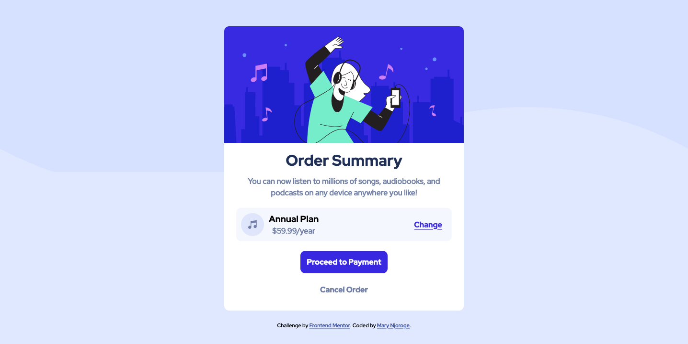

# Frontend Mentor - Order summary card solution

This is a solution to the [Order summary card challenge on Frontend Mentor](https://www.frontendmentor.io/challenges/order-summary-component-QlPmajDUj). Frontend Mentor challenges help you improve your coding skills by building realistic projects.

## Table of contents

- [Overview](#overview)
  - [The challenge](#the-challenge)
  - [Screenshot](#screenshot)
  - [Links](#links)
- [My process](#my-process)
  - [Built with](#built-with)
  - [What I learned](#what-i-learned)
  - [Continued development](#continued-development)
  - [Useful resources](#useful-resources)
- [Author](#author)
- [Acknowledgments](#acknowledgments)


## Overview

I loved the challenge. It helped me master some of the styling I haven't been enjoying like the media query. I am better than when I started to work on the project.

### The challenge

Users should be able to:

- See hover states for interactive elements

### Screenshot



### Links

- Solution URL: [Add solution](https://awesome-poincare-07800c.netlify.app/)

## My process

### Built with

- Semantic HTML5 markup
- CSS custom properties
- Flexbox
- Mobile-first workflow
- [Styled Components]('https://fonts.googleapis.com/css2?family=Red+Hat+Display:ital,wght@0,500;0,700;0,900;1,500;1,700&display=swap') - For styles


### What I learned

My major lesson was adding the patterned background svg in the body with just a line of code.

To see how you can add code snippets, see below:

```css
.dance-image{
    background: url('./images/pattern-background-desktop.svg') no-repeat center/cover;
}
```
I practiced the media query components and I have mastered the technique quit well now.


### Continued development

During the challenge I came across the hover states it was my first time working on them and I would like to do more of that in my next project.
Media query has for the longest been bugging me but I think working on it on this project was not overwhelming. I would like to work more on this as well.


### Useful resources

- [Resource 1](https://www.youtube.com/watch?v=uaM5F8O_VI8) - I would recommend any one learning CSS to watch his tutorials they are well explained and simple to understand. I learned how to center my <divs>. The media query concept is now easy for me to handle any similar website.


## Author

- Frontend Mentor - [@Maryahcee](https://www.frontendmentor.io/profile/Maryahcee)
- Twitter - [@maryah_peters](https://www.twitter.com/yourusername)


## Acknowledgments

I am grateful to my hubby Harrison kimani for the insigts while working on my container and on the motivation during the whole project. 
